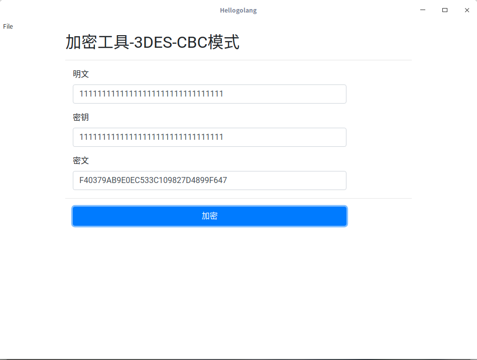

使用Go语言写的GUI程序，演示如何使用go语言写GUI程序。
脱胎于go-astilectron-demo




# Step 1: install the demo

Run the following commands:

    $ go get -u github.com/asticode/go-astilectron-demo/...
    $ rm $GOPATH/src/github.com/asticode/go-astilectron-demo/bind.go

# Step 2: install the bundler

Run the following command:

    $ go get -u github.com/asticode/go-astilectron-bundler/...
    $ go install github.com/asticode/go-astilectron-bundler/astilectron-bundler

Go get and build the binary.
And don't forget to add `$GOPATH/bin` to your `$PATH`.

# Step 3: bundle the app for your current environment

Run the following commands:

    $ cd $GOPATH/src/github.com/asticode/go-astilectron-demo
    $ astilectron-bundler -v

# Step 4: test the app

The result is in the `output/<your os>-<your arch>` folder and is waiting for you to test it!

# Step 5: bundle the app for more environments

To bundle the app for more environments, add an `environments` key to the bundler configuration (`bundler.json`):

```json
"environments": [
  {"arch": "amd64", "os": "linux"},
  {"arch": "386", "os": "windows"}
]
```

and repeat **step 3**.
